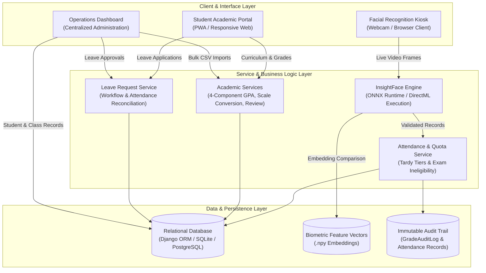
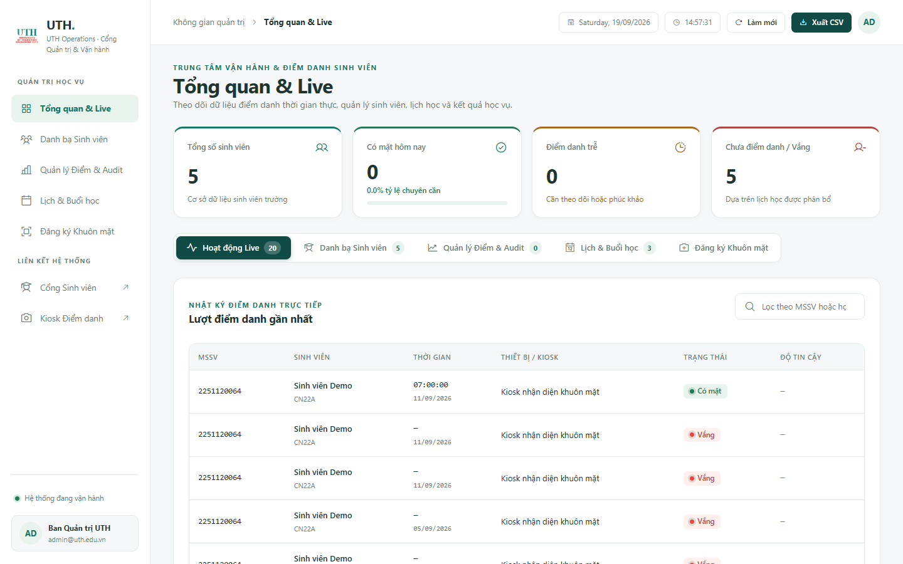
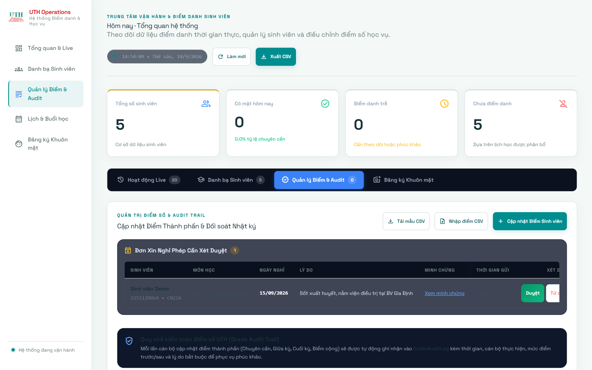
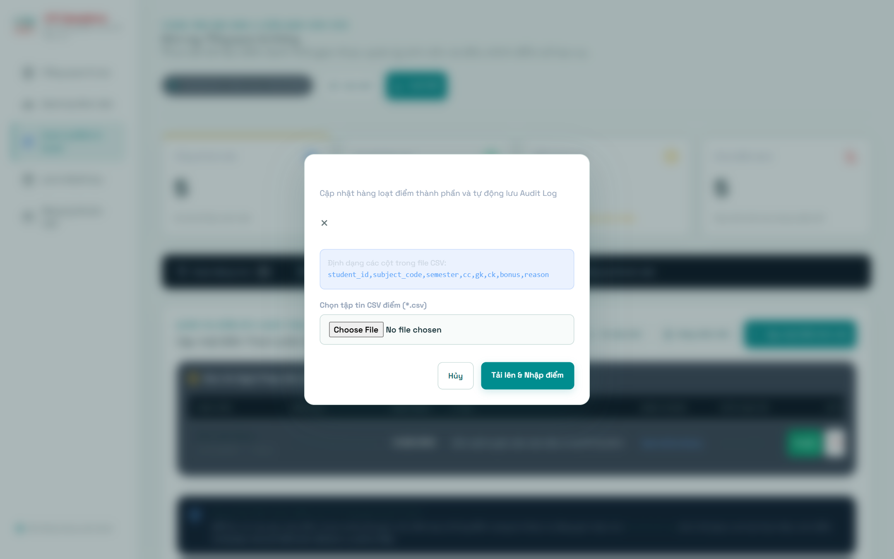
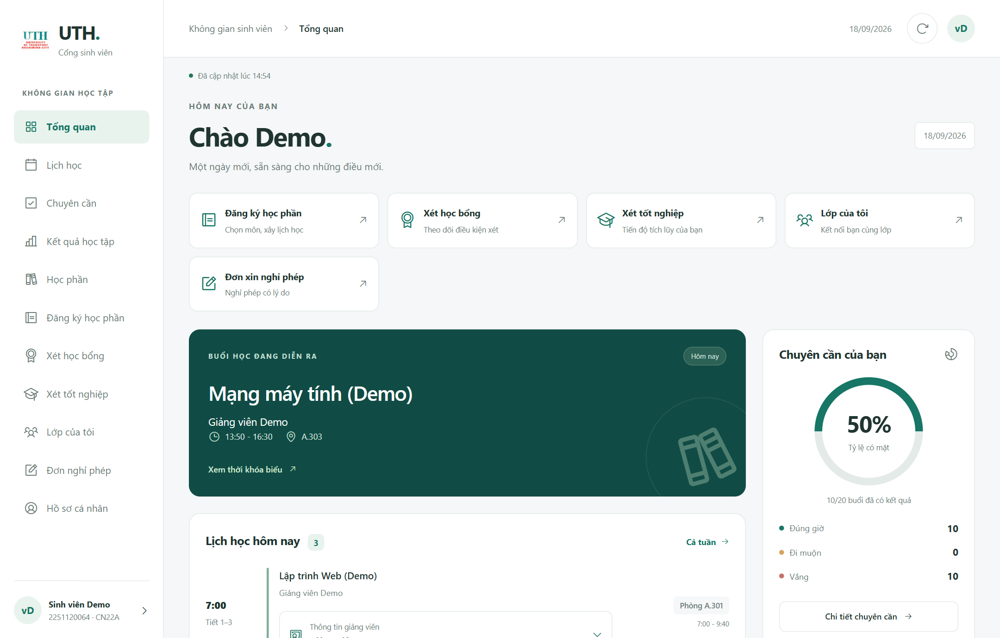
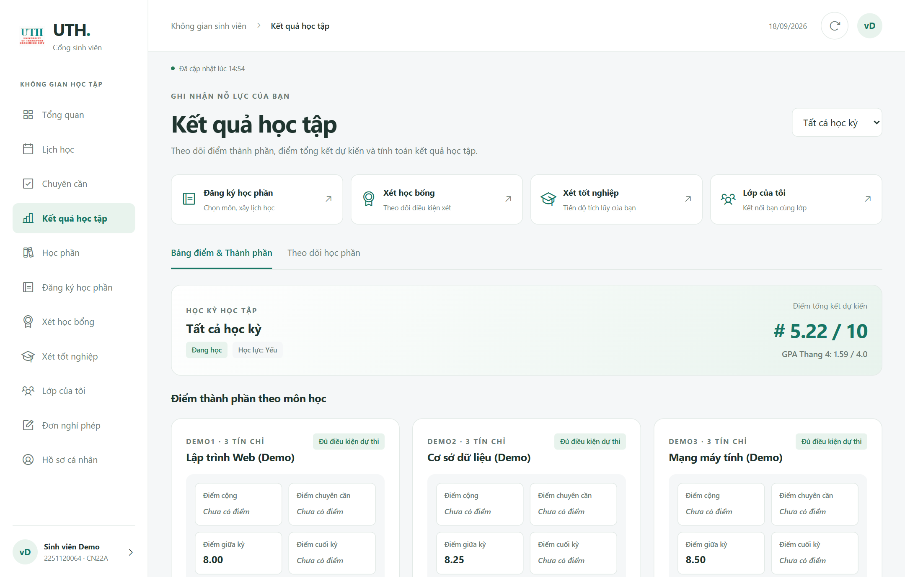
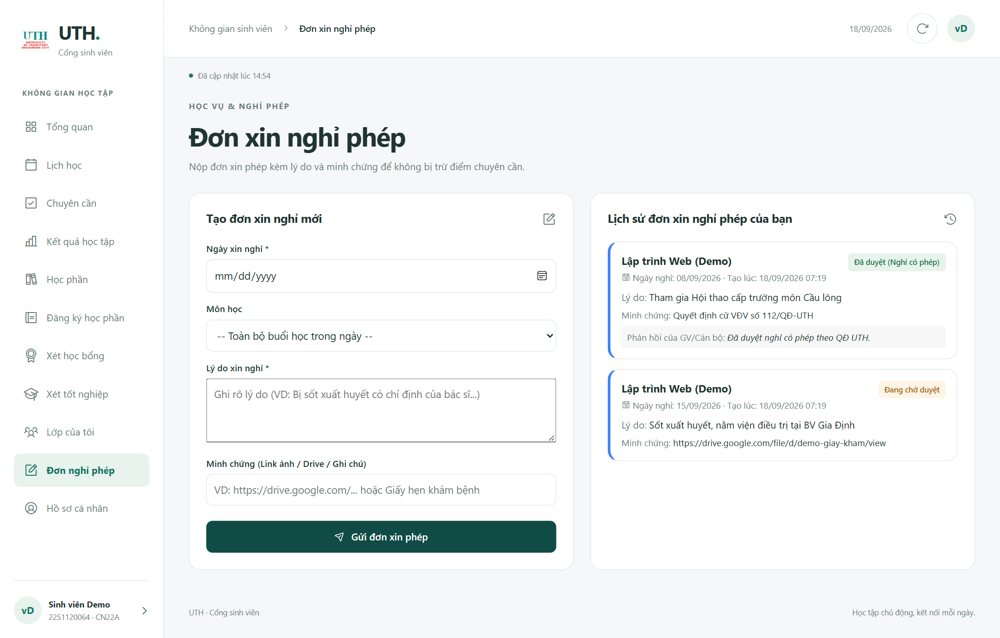
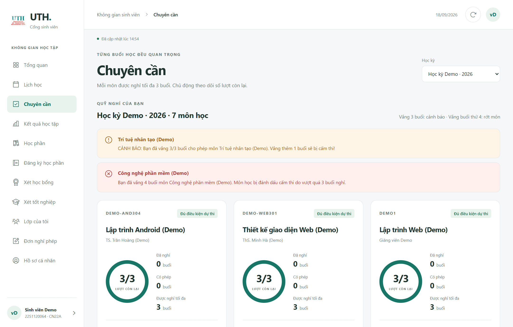

# UTH Attendance & Academic Portal System

<div align="center">

[](https://www.djangoproject.com/)
[](https://www.python.org/)
[](https://github.com/deepinsight/insightface)
[](https://onnxruntime.ai/)
[](https://playwright.dev/)
[](LICENSE)

**Integrated AI Facial Recognition Attendance Kiosk, Student Academic Portal, and Operations Management Platform**

*Standardized for Credit-Based University Curriculum Systems*

[Overview](#overview) | [System Architecture](#system-architecture) | [Core Features](#core-features) | [Interface Gallery](#interface-gallery) | [Installation & Deployment](#installation--deployment) | [Demonstration Accounts](#demonstration-accounts) | [Automated Testing](#automated-testing) | [Project Structure](#project-structure)

</div>

---

## Overview

The **UTH Attendance System** is an enterprise-grade academic operations and automated attendance platform designed for modern higher education institutions. Built on Django and accelerated AI vision pipelines, the system eliminates attendance fraud, simplifies course administration, and provides transparent academic outcomes to students in real time.

### Key Capabilities
1. **Automated Biometric Verification:** Edge-capable kiosk powered by InsightFace and ONNX Runtime for instant face detection, 512-dimensional vector matching, and anti-spoofing verification.
2. **Standardized Academic Engine:** Automated 4-component grading (Attendance, Midterm, Final Exam, Bonus Points), 10-point to 4-point GPA conversion, letter grades, and graduation/scholarship audit rules.
3. **Absence Quota & Exam Eligibility Enforcement:** Real-time quota monitoring that tracks absences against institutional thresholds (maximum 20% course duration), with multi-tiered risk alerts (`Eligible`, `Exam Bar Warning`, `Barred from Exam`).
4. **End-to-End Online Leave Management:** Student leave submission with digital evidence attachments, administrative 1-click review, and automated synchronization with attendance rosters.
5. **Administrative Operations Dashboard:** Executive KPI tracking, live session controls, bulk grade management via CSV with full validation, and immutable audit logs (`GradeAuditLog`).

---

## System Architecture



---

## Core Features

### 1. Facial Recognition Attendance Kiosk
* **High-Speed Deep Learning Inference:** Employs InsightFace deep recognition models executing via ONNX Runtime with hardware acceleration support (DirectML and CUDA).
* **Automated Period & Late Threshold Rules:**
  * **On Time (0 to 15 minutes):** Marked as `ON_TIME`.
  * **Tardy Level 1 (16 to 59 minutes):** Marked as `LATE_ONE_PERIOD` (1 period penalty).
  * **Tardy Level 2 (60 to 120 minutes):** Marked as `ABSENT_TWO_PERIODS` (2 periods penalty).
  * **Absent (> 120 minutes or no scan):** Marked as `ABSENT` (full session absence).
* **Roster Boundary Enforcement:** Automatically validates recognized identities against active course enrollment to prevent unauthorized check-ins.

### 2. Academic Grading & Credit Computation Engine
* **Weighted Component Formula:**
  $$\text{Official Score} = \min\left(10.0, (\text{Attendance} \times W_{cc}) + (\text{Midterm} \times W_{gk}) + (\text{Final Exam} \times W_{ck}) + \text{Bonus}\right)$$
* **Automated GPA & Letter Grade Mapping:**
  * Score $\ge 9.0$: **A+** (GPA 4.0) - Excellent
  * Score $\ge 8.5$: **A** (GPA 3.7) - Very Good
  * Score $\ge 8.0$: **B+** (GPA 3.5) - Good
  * Score $\ge 7.0$: **B** (GPA 3.0) - Above Average
  * Score $\ge 6.5$: **C+** (GPA 2.5) - Average
  * Score $\ge 5.5$: **C** (GPA 2.0) - Pass
  * Score $\ge 5.0$: **D+** (GPA 1.5) - Conditional Pass
  * Score $\ge 4.0$: **D** (GPA 1.0) - Pass
  * Score $< 4.0$: **F** (GPA 0.0) - Poor (Course Repeat Required)
* **Interactive Target Grade Calculator:** Allows students to simulate required final exam scores to reach desired letter grades based on active syllabus weights.

### 3. Absence Quota & Exam Ineligibility Protection
* **Institutional Threshold Enforcement:** Automatically triggers warnings when accumulated unexcused absences reach 20% of total class hours (equivalent to 3 sessions for standard 3-credit courses).
* **Three-Tier Safety Classification:**
  * **Eligible:** 0 to 2 unexcused absences.
  * **Exam Bar Warning:** Exactly 3 unexcused absences. Notice issued indicating any additional absence results in exam disqualification.
  * **Barred from Exam:** Greater than 3 unexcused absences. Student is prohibited from taking the final exam.
* **Separation of Excused Leaves:** Approved leave requests (`EXCUSED`) are isolated from unexcused quotas, protecting students against unjustified exam penalties.

### 4. Online Leave Request Management
* **Digital Submission:** Students apply for excused absences directly via the portal, specifying date, course scope (single session or full day), and evidence URLs (medical certificates, official permits).
* **Administrative Decision Hub:** Instructors and staff review pending requests with 1-click Approve or Reject actions and optional feedback notes.
* **Automated Roster Reconciliation:** Approved requests automatically create or update attendance records to `EXCUSED`, updating student quotas in real time.

### 5. Administrative Bulk Operations & Audit Logging
* **Standardized CSV Import & Export:** Download pre-formatted CSV templates scoped to specific courses and semesters, and import hundreds of student component grades in seconds.
* **Immutable Audit Trail:** All grade adjustments are tracked in `GradeAuditLog` capturing editor identity, previous score, new score, timestamp, and justification.
* **Central Executive Dashboard:** Real-time KPI summary (Total Students, Present Today with percentage progress, Tardy Count, Absent Count), live session feeds, and student directory with quick credential lookup.

### 6. Security & Internationalization
* **Password Encryption:** Sensitive credentials protected via salted **PBKDF2-SHA256** one-way hashing with backward-compatible class fallback for initial logins.
* **Access Control:** Role-based access control protecting administrative endpoints (`staff_member_required`) and session-scoped student APIs (`student_api_required`).
* **Complete English Localization:** 100% standardized English across all interface components, backend services, API error payloads, and database records. Includes anti-auto-translation metadata (`translate="no"` and `<meta name="google" content="notranslate">`) to prevent browser translation artifacts.

---

## Interface Gallery

All interface views are rendered using the Deep Spruce and Obsidian design language. Visual artifacts are verified using headless browser automation:

### 1. Operations & Administrative Dashboard
Central operations hub displaying executive metrics, real-time check-in stream, and pending leave approvals.


### 2. Bulk Grade Management & Audit Trail
Course-level grade management interface with live validation and chronological change logs.


### 3. Bulk CSV Grade Import Dialog
Standardized data upload modal with column mapping, boundary checking, and preview verification.


### 4. Student Portal Workspace
Student landing view highlighting daily schedules, attendance progress rings, and fast access shortcuts.


### 5. Academic Results & Interactive Calculator
Complete component grade ledger with 4-point scale conversions and target grade simulation.


### 6. Online Leave Application Portal
Student submission form with document attachments and historical status tracking.


### 7. Attendance Quota & Exam Warning Overview
Real-time absence limit indicators detailing permitted absences, excused sessions, and barring notices.


---

## Technology Stack

| Domain | Technology | Purpose |
|---|---|---|
| **Backend Framework** | Django 4.2+ (Python 3.10+) | Core business logic, ORM, REST API endpoints, session security |
| **Computer Vision** | InsightFace, OpenCV, ONNX Runtime | Deep facial recognition inference, 512D vector embeddings, DirectML acceleration |
| **Frontend Architecture** | Vanilla ES Modules, CSS3, Tailwind CSS | Modular client scripts, responsive layout, dark/light theme support |
| **Iconography & Typography** | Phosphor Icons, Plus Jakarta Sans, Space Grotesk | Design tokens, executive dashboard aesthetics, tabular numerical alignment |
| **Database** | SQLite (Development) / PostgreSQL (Production) | Normalized relational storage, transaction locking, data integrity |
| **Testing & Quality** | Django Test Runner, Playwright | Automated unit testing (75 test cases), headless visual verification |

---

## Installation & Deployment

### Prerequisites
* Operating System: Windows 10/11, macOS, or Linux
* Python: Version **3.10** or higher
* Modern Web Browser: Google Chrome, Microsoft Edge, or Mozilla Firefox
* Camera Device (Optional, required for physical kiosk check-in)

### Step-by-Step Setup

1. **Clone the repository:**
   ```bash
   git clone https://github.com/vinh0407/UTH-Attendance.git
   cd UTH-Attendance
   ```

2. **Create and activate a virtual environment:**
   * On Windows (PowerShell):
     ```powershell
     python -m venv .venv
     .\.venv\Scripts\Activate.ps1
     ```
   * On macOS / Linux:
     ```bash
     python3 -m venv .venv
     source .venv/bin/activate
     ```

3. **Install project dependencies:**
   ```bash
   python -m pip install --upgrade pip
   python -m pip install -r admin_check/requirements.txt
   ```

4. **Apply database schema migrations:**
   ```bash
   python admin_check/manage.py migrate
   ```

5. **Start the local development server:**
   ```bash
   python admin_check/manage.py runserver 127.0.0.1:8000
   ```

6. **Access application endpoints:**
   * **Administrative Operations Hub:** [http://127.0.0.1:8000/admin-dashboard/](http://127.0.0.1:8000/admin-dashboard/)
   * **Student Academic Portal:** [http://127.0.0.1:8000/student-portal/](http://127.0.0.1:8000/student-portal/)
   * **Attendance Kiosk Interface:** [http://127.0.0.1:8000/kiosk/](http://127.0.0.1:8000/kiosk/)
   * **Django Superuser Admin:** [http://127.0.0.1:8000/admin/](http://127.0.0.1:8000/admin/)

---

## Demonstration Accounts

Pre-configured demonstration credentials for immediate evaluation:

| Role | Username / Student ID | Password / Class | Permissions & Scope |
|---|---|---|---|
| **System Administrator** | `admin` | `admin123` | Full administrative operations, leave approval, grade management |
| **Primary Demo Student** | `2251120064` | `CN22A` | Populated student profile with grades, quota warnings, and leave records |
| **Secondary Demo Student** | `2251120065` | `CN22A` | Alternative enrolled profile for testing concurrent sessions |

---

## Automated Testing

The project maintains comprehensive unit and integration test coverage across all domain services.

### Running Unit Test Suites
Execute the full suite of 75 automated test cases:
```bash
python admin_check/manage.py test portal
```

**Test Verification Summary:**
* **Leave Requests:** Submissions, role verification, and automated `EXCUSED` attendance reconciliation.
* **Quota Rules:** Excused versus unexcused calculation, barring thresholds, and alert notifications.
* **Grade Calculations:** 4-component weighted formulas, GPA scale 4 conversions, and CSV bulk import validation.
* **Security & Authentication:** Password hashing, session enforcement, and unauthorized access rejection.

### Headless Visual Verification
Run automated browser verification and screenshot captures using Playwright:
```bash
python -m pip install playwright
python -m playwright install
python scripts/capture_screenshots.py
```

---

## Project Structure

```text
UTH-Attendance/
|-- admin_check/                      # Primary Django application hub
|   |-- attendance_system/            # Project configuration (settings, URLs, WSGI)
|   |-- portal/                       # Core domain application
|   |   |-- models.py                 # Data models: Student, Grade, LeaveRequest, AuditLog
|   |   |-- views.py                  # Primary view handlers and REST API endpoints
|   |   |-- academic_services.py      # GPA scale conversion, credit logic, academic reviews
|   |   |-- academic_views.py         # Academic and course registration API endpoints
|   |   |-- student_attendance.py     # Attendance quota and exam barring calculations
|   |   |-- attendance_service.py     # Session recording, timing, and late thresholds
|   |   |-- face_recognition.py       # Biometric inference and feature vector matching
|   |   |-- urls.py                   # Route definitions
|   |   `-- tests.py                  # Automated test cases (75 passing tests)
|   |-- static/                       # Static assets (stylesheets, JavaScript, icons)
|   |   |-- css/styles.css            # Central stylesheet
|   |   `-- js/main.js                # Client controller scripts
|   |-- templates/                    # Template directory
|   |   |-- base.html                 # Master application template
|   |   `-- portal/                   # Module templates (admin_dashboard, portal, kiosk)
|   `-- manage.py                     # Django management CLI
|-- APP/                              # Application client packages
|   |-- Máy điểm danh/                # Facial recognition kiosk web interface
|   |-- Portal/                       # Student Portal single-page application client
|   `-- Dữ liệu/                      # Data boundary storage (biometric embeddings, archives)
|-- docs/                             # Engineering documentation and visual assets
|   |-- screenshots/                  # High-resolution application captures
|   |-- REFERENCE_ANALYSIS_AND_INTEGRATION.md
|   `-- STUDENT_ATTENDANCE_QUOTA.md
|-- legacy/                           # Standalone OpenCV prototype archive
|   `-- project.py                    # Original desktop camera CLI check-in prototype
|-- scripts/                          # Automation, localization, and testing utilities
|   |-- capture_screenshots.py        # Automated Playwright visual QA capture script
|   |-- test_portal_utils.mjs         # Portal client utility test suite
|   |-- translate_db_to_en.py         # Database localization and demo seeder
|   `-- verify_english_portal.py      # Automated localization and anti-translation test suite
|-- .gitignore                        # Git ignore specifications
`-- README.md                         # Project documentation
```

---

## License & Attribution

This software is developed for academic, educational, and institutional research purposes within higher education institutions.

All contributions and issues are welcome via GitHub Pull Requests and Issues.
